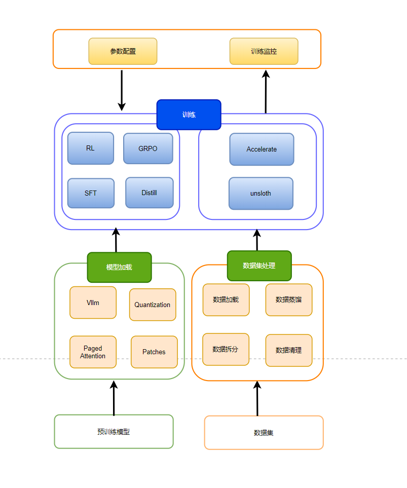
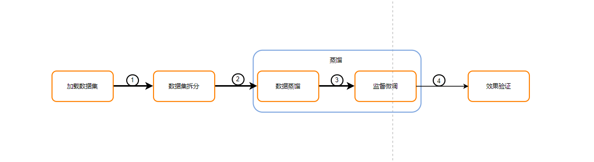
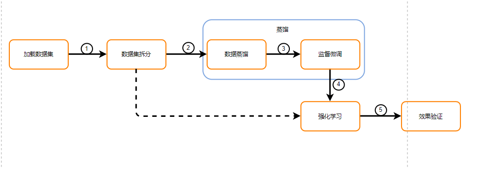

<h3 align="center">
    基于unsloth对LLM模型进行微调及GRPO RL训练，提供对LLM大语言模型进行一站式SFT微调及GRPO 强化学习训练
</h3>

## Contant

- [Featue](#Feature)
- [Update Logs](#Update)
- [Deploy](#Deploy)
- [Notes](#Notes)

## Feature

- Supports Deepseek，Qwen，Llama LLM models for training。
- Supports full-finetuning, pretraining, 4b-bit, 16-bit and 8-bit training.
- Finetune Llama 4, DeepSeek-R1, Gemma 3 & Reasoning LLMs 2x faster with 70% less memory.
- Inference is based on the vllm ,  training is based on the unsloth.
- Metax GPU suppored, Support Muxi C500/C550/C280 
- Supports dataset splitting, dataset distillation, and dataset cleaning

## FrameWork
The framework of the project is shown in the figure below:


### SFT
The SFT fine-tuning training process is shown in the following figure:


### GRPO
The GRPO RL training process is shown in the following figure:


## Update

[25/03/11] 
Supports data segmentation, data distillation based on (Deepseek), based on Unsloth full-volume Finetune, GRPO reinforcement learning training and reasoning
Supports dynamic addition of independent training or reasoning Gradio pages, and can configure the backend to execute python scripts or commands
Supports configuration of training parameters based on training type or other conditions, and default loading of pre-trained weights
Supports one-click deployment of training on domestic Muxi card all-in-one machines


## Deploy

### Deploy And Startup

```bash
git clone https://github.com/ataraxialab/deepseek-factory.git
git checkout main
#set LOCAL_PATH env value for your training dataset and create image and startup deepseek-factory container
LOCAL_PATH=/home/metax/yiyu/deepseek-factory/training-data docker compose up
#open webui when the container is started successfully , default web port is 8080
http://server-ip:8080/
```

## Notes
- Before deploying the project, you need to download the mxc500-torch2.1-py310:mc2.29.0.9-ubuntu22.04-amd64 image from metax softcenter
- Currently the project only supports Metax Maca 2.29.x.x version, and subsequent versions are being continuously updated.
- If you need to update the vllm or bitsandbytes package, please put the package in the pkgs directory according to the current directory structure. Please make sure that the updated package is compatible with maca2.29.x.x
